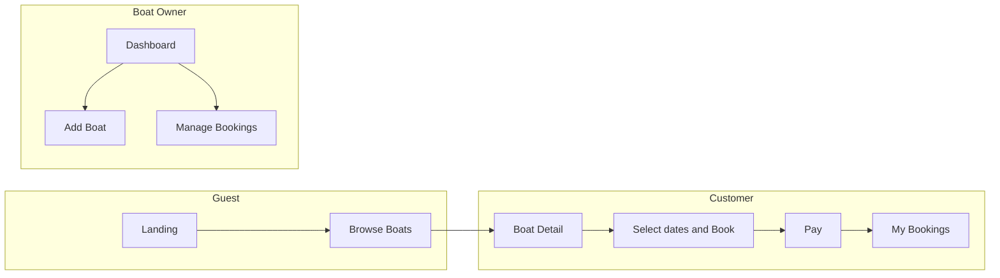

# JumpInBoat MVP – Product Specification (Features Only)

This spec is based on the [current live app](https://jumpinboat-app.vercel.app/) and an Uber-like two-sided marketplace: **passengers / shippers / agencies** book licensed boat services, while **operators** list boats and receive bookings. The **MVP includes both a web application and a mobile application**; technology choices (e.g. native vs cross-platform) are left for later.

Important product constraint: **boats are never rented without a skipper/captain**. The app is intended for **licensed passenger and cargo transport providers, tourist agencies, and excursion boats**, not for bareboat rental where a customer takes an empty boat alone.

### Operational constraints (summary)

The following rules apply across the whole product and must be reflected in UX, data model, and validation:

- **Skipper-only (no bareboat)**: Boats are **never** rented without a professional skipper/captain. The platform is only for licensed passenger transport, cargo/supply transport, tourist agencies, and excursion boats—**not** for renting an empty boat to the end-user. All listing and marketing copy must reinforce this; bareboat rental is explicitly out of scope.
- **Weather and cancellation risk**: Integrate a weather provider (**Windy**, **Yr**, or **AccuWeather**) so each **departure** and route has linked forecast data. Show an estimated **cancellation probability (in %)** due to weather on the map, trip detail, booking flow, and in owner dashboard / My bookings. Operators and customers can see weather-based risk for each trip.
- **Map providers**: Use **OpenStreetMap (OSM)** as the **sole, free map provider** for the MVP. All map features (start, end, stops, routes, “near me”) are implemented on top of OSM.
- **Capacity and cargo limits**: Every listing has **maximum passenger count** (people) and **allowed total boat load/weight** (legally permitted total). System tracks **booked vs free** spots per departure and enforces that bookings cannot exceed max passengers or total load. For **goods/food transport**: list **max package count**, **max cargo weight (kg)**, allowed goods description, and optional price by weight—all within the boat’s permitted total load. Enforce these limits in the data model and at booking validation; show capacity and cargo rules clearly in discovery, detail, and owner dashboard.

**Cross-cutting**: Enforce skipper-only in all boat-creation flows and marketing. Enforce capacity and weight at validation. Owners see per-departure view of booked passengers, cargo weight, and weather-based cancellation risk. Customers see skippered transport, capacity, cargo rules, and weather cancellation likelihood before booking.

---

## 1. What the current app already suggests

From the live site:

- **Landing**: Hero, “Browse Boats” and “List Your Boat”, feature bullets (Easy Booking, Island Routes, Owner Dashboard, Flexible Pricing).
- **Auth**: Sign up / Sign in with **account type**: “Customer – Book boats” vs “Boat Owner – List your boats” (current app); for MVP, a user can have **both** roles.
- **Boats**: `/boats` listing (currently empty); no public boat detail or dashboard content visible without auth.

So the product is a **two-sided marketplace for booked transport services** with two roles and a shared auth entry point. The MVP spec below turns this into a concrete feature set.

---

## 2. User roles and entry points

| Role           | Description                                                                  | Primary entry                                               |
| -------------- | ---------------------------------------------------------------------------- | ----------------------------------------------------------- |
| **Guest**      | Not logged in; can browse boats and see landing                              | Landing, Browse Boats                                       |
| **Customer**   | Books skipper-led passenger or cargo transport services                      | Sign up as “Customer”, then search and book                 |
| **Boat Owner** | Lists licensed transport boats, sets departures and price, receives bookings | Sign up as “Boat Owner”, then add boats and manage bookings |

- One user account can have both roles: Customer and Boat Owner. The same person can list transport boats and book other transport services; signup can collect which capabilities they want (e.g. “Book transport”, “List your boat”, or both), and the app exposes both “My bookings” and “Owner dashboard” as needed.
- Auth: sign up, sign in, optional “Sign in with Google” as in the current app.

---

## 3. Core user journeys (MVP)

### 3.1 Customer journey (Uber “rider” side)

1. **Discover** – Search by **start and end location** on the map, or by **“near me”** (current location). Filter by **return trip** vs **one way**. Search by **date and time-of-day**. If an owner’s listing has **stops**, those stops are searchable; results show **all stops** for each listing. List view shows **capacity** as **booked** and **free** spots (e.g. “3/6” or “3 booked, 3 free”), plus the boat’s **maximum passenger count** and **allowed total load/weight**. Optional filters: price range, passenger capacity, cargo capacity.
2. **Choose** – Open a **boat detail page**: description, photos, price, passenger capacity, allowed total load/weight, **route on the map** with **start, end, and all stops** precisely shown, owner info, basic availability, and weather / cancellation risk indicators.
3. **Book** – Select **date and time-of-day** and submit a booking request (or instant book); owner accepts or declines in request flow.
4. **Pay** – **Pay on arrival only** (no online card payment in MVP).
5. **Confirm** – See a **booking confirmation** (on-screen and/or email).
6. **Manage** – In “My bookings”, view upcoming and past bookings and status (pending, confirmed, completed, cancelled).

### 3.2 Owner journey (Uber “driver” side)

1. **Onboard** – Sign up as Boat Owner (as in current app).
2. **List boat** – Create a **boat listing**: name, short description, **start and end location** and optional **stops**, each **precisely defined on the map** (pin or point; stored as coordinates), **price per trip and, optionally, price per stop (e.g. per intermediate stop/segment)**, **passenger capacity** (max people; system tracks **booked** vs **free** spots per departure), **allowed total boat load/weight**, photos, basic rules (e.g. no pets), and confirmation that the service includes a **skipper/captain**. Optionally **offer goods / food transport**: owner describes **allowed goods**, **maximum package quantity**, **maximum cargo weight**, and pricing by weight or shipment unit, always constrained by the boat’s legally allowed total weight.
3. **Availability** – Set when the boat is available (e.g. calendar or recurring availability), including **time-of-day** / departures; optionally block specific dates/times.
4. **Receive bookings** – See incoming requests in an **owner dashboard**; accept or decline (request flow). Owner receives **email** and **WhatsApp** notifications for each new booking request (and optionally for accepted/declined/cancelled).
5. **Manage** – View “My boats”, “My bookings”, weather-linked departure status, and update listing or availability.

---

## 4. MVP feature list (by area)

### 4.1 Authentication

- Email + password sign up and sign in.
- **Account type at signup**: Customer vs Boat Owner (as on current app).
- Optional: “Sign in with Google” (already present on live app).
- Password reset (forgot password) – recommended for MVP.
- Sign out.
- Protected routes: dashboard and “my bookings” require login; owner flows require owner role.

### 4.2 Boat listings (owner-side)

- **Create listing**: name, description, **start location**, **end location**, and optional **stops**—each **precisely defined on the map** (user places a pin or point; stored as coordinates, e.g. lat/lng). Route is searchable by any segment. **Price per trip (base price for the full route) and optional price per stop (e.g. boarding/disembarking at intermediate stops; owner can set either a uniform per-stop price or specific prices per stop)**, **passenger capacity** (max passengers; booked vs free derived from bookings per departure/slot), **allowed total boat weight/load**, and confirmation that the trip is operated **with skipper/captain included**. At least one photo (upload or URL). Optional **goods / food transport**: owner can indicate the boat is available for cargo and provide **allowed goods** (text description, e.g. “general cargo”, “perishables”, “food supplies”), **maximum package count**, **maximum cargo weight** (kg), and **price by weight** (e.g. per kg or per 100 kg); cargo limits must stay within the boat’s legally permitted total load. **Multi-language content**: owner can provide listing name, description, allowed goods text, and location labels in **multiple languages** (English and Croatian); the create/edit listing UI offers an interface for this (e.g. language tabs or “add translation” per field). **Automatic translation** is available: owner writes in one language and can trigger “Translate to [other language]” (AI or translation API); they can edit the result before saving (see Section 4.10).
- **Edit / deactivate** own listings.
- **List “My boats”** in owner dashboard.
- **Availability**: calendar/slots with **time-of-day** and departures; block/unblock specific dates and times.

### 4.3 Discovery and boat detail (customer-side)

- **Search by route**: **start location** and **end location** (required), each **precisely defined on the map** (user picks a point; matching uses coordinates / proximity). Filter by **return trip** vs **one way**. Search by **date and time-of-day**.
- **Search by “near me”**: user can search for boats/routes **near their current location** (browser or device geolocation). Start is set to “my location”; end can be chosen on the map or left open to show all listings that start or pass near the user. Same filters (return/one way, date + time, price, capacity) apply.
- **Stops**: if a listing has stops (all map-defined), search matches when start/end or any **stop** matches the user’s start/end; **listing and detail show all stops** in order and **display the full route on the map** (start, stops, end as pins or path).
- **Browse results**: list view with photo, name, route (start → … stops … → end), **pricing (clearly labelled as per trip and, when configured, per stop – e.g. “€X per trip” or “from €Y per stop”)**, **capacity as booked and free** (e.g. “3/6” or “3 booked, 3 free”), **maximum passenger count**, **allowed total load/weight**, and a clear label that the service includes a **skipper/captain**; optional small map preview per result; if listing offers **goods transport**, show a hint (e.g. “Goods transport”, max cargo weight / packages).
- **Filters**: start/end (map or **near me**), return vs one way, date + time, price range, capacity (min free spots), passenger count, cargo weight; optional filter for **goods transport** (show only listings that offer it).
- **Boat detail page**: all listing fields, **route on map** with **all stops** precisely shown (start, end, and any stops as distinct points), owner info, booked/free spots, maximum passenger count, allowed total load/weight, and notice that the trip is run **with skipper/captain included**. **Show clear pricing: base price per trip and, when configured, price per stop for boarding/disembarking at intermediate stops, with labels that distinguish per-trip vs per-stop amounts.** When owner offers **goods transport**, show **allowed goods**, **maximum package count**, **maximum cargo weight**, and **price by weight**. “Book this boat” CTA.
- Show **availability** on detail (e.g. available dates/times or “Request to book”).
- **Weather awareness**: integrate a weather provider such as **Windy**, **Yr**, or **AccuWeather** so each departure and route can show forecast context and an estimated **cancellation probability due to weather conditions**. This appears on the map / trip detail and in owner booking management.
- **Map providers**: use **OpenStreetMap (OSM)** as the sole, free map provider; all map rendering (routes, pins, "near me") is implemented on top of OSM.

### 4.4 Booking flow

- **Select date and time-of-day** on boat detail or a dedicated booking step.
- **Request flow**: customer sends request → owner accepts or declines in dashboard → no online payment; **pay on arrival**.
- **Booking record**: boat, route (start, end, stops), owner, customer, date and time, price, status (pending, confirmed, completed, cancelled), and weather-risk snapshot for the departure when relevant. For **goods transport** bookings: requested/declared package count and/or weight (optional at request time); final price can follow owner’s price-by-weight (pay on arrival), constrained by permitted total load.
- **Confirmation**: on-screen confirmation and optional confirmation email to customer.

### 4.5 Payments (MVP scope)

- **Pay on arrival only**: no online card or in-app payment in MVP. Renter pays the owner in cash or other means at the time of the trip.
- **Transparent pricing**: show total (e.g. per trip + any per-stop charges and any simple fees) on the listing and before confirming the booking request, clearly indicating whether the price is **per trip**, **per stop**, or a combination (e.g. base trip price plus selected stops).
- **Owner payout**: handled offline (owner collects on arrival); no platform payout integration in MVP.

### 4.6 Owner dashboard

- **My boats**: list of own listings with edit/deactivate.
- **My bookings**: incoming and accepted bookings with customer info, route, date and time; **accept or decline** incoming requests.
- **Availability**: block/unblock dates and time-of-day per boat (simple list or calendar).
- **Notifications**: owner receives **email** and **WhatsApp** notifications for each new booking request (and optionally for accepted/declined/cancelled so they can stay in sync).
- **Departure risk monitoring**: bookings / departures can display linked forecast data and a weather-based cancellation likelihood so operators can proactively manage affected trips.

### 4.7 Renter “My bookings”

- **Upcoming bookings**: boat, dates, status, link to boat detail.
- **Past bookings**: same, for history and optional future “reviews”.
- **Cancel booking** (with simple policy, e.g. free cancel until X days before).

### 4.8 Landing and navigation

- **Landing page**: value proposition, “Browse Boats”, “List Your Boat”, short feature list (as now), with messaging focused on **licensed skipper-led transport**, excursion services, and cargo / supply delivery rather than bareboat rental.
- **Navigation**: persistent header with Browse Boats, List Your Boat (or Dashboard when owner), Sign in / Sign up or account menu (My bookings, Dashboard, Sign out).

### 4.9 Platforms: web and mobile

- **Web application**: full MVP experience in the browser (responsive where needed). All features in this spec apply to web (map, search, booking, dashboard, i18n, timezone, weather risk, etc.).
- **Mobile application**: the MVP includes a **dedicated mobile app** (iOS and Android) so users can discover, book, and manage listings on the go. Core flows (discover with “near me”, map-defined routes, book, owner dashboard, notifications, weather-linked departures) are supported on mobile with **feature parity** for these flows; same backend and data as web. Device capabilities used on mobile: **geolocation** (“near me”), **push notifications** (booking requests, accept/decline; can complement or supplement email/WhatsApp for owners). Technology choice (native, React Native, Flutter, PWA, etc.) is part of the later stack decision.

### 4.10 Internationalization (i18n)

- **Multiple languages** (web and mobile): the app supports **multiple languages/locales** for all UI strings (labels, buttons, messages, errors, validation, empty states). No user-facing text is hardcoded; everything is sourced from translation files or keys.
- **Locale detection**: default language is determined from browser or device (e.g. `Accept-Language` header or `navigator.language`). User can override via a **language switcher** (e.g. in header, footer, or account/settings).
- **Formatting**: dates, times, numbers, and currency are formatted according to the active locale (aligns with timezone handling for date/time; see Section 5).
- **MVP scope**: support **English** and **Croatian**; structure the codebase so further languages can be added without code changes. Language preference can be stored in the user’s profile or in local storage for guests.
- **User-generated content (listings) is translatable**: listing titles, descriptions, “allowed goods”, and location names/labels can be provided in multiple languages (English and Croatian in MVP). The app provides an **interface for owners to describe their listing in multiple languages** (e.g. tabs or fields per language, or “add translation” for each text field). Renters see listing content in their selected UI language when a translation exists; otherwise fall back to the owner’s primary language or first available.
- **Automatic translations**: the app supports **automatic translation** of listing content into other supported languages. Options for MVP: (1) **AI-based translation** (e.g. LLM or translation API): owner writes in one language, system suggests or generates translations; owner can edit before saving. (2) **Translation API** (e.g. Google Translate, DeepL): one-click “Translate to Croatian/English” with optional post-edit. Consider **cost, latency, and quality**: AI/LLM can give more context-aware, domain-specific wording (e.g. “boat”, “marina”) and can be run in-house or via provider; traditional APIs are cheaper and faster for bulk text. Store both auto-translated and manually edited versions so owners retain control; mark translations as “auto” vs “edited” if useful for future UX (e.g. “Improve this translation”).

---

## 5. Time zone handling (MVP)

All date/time in the app is shown and interpreted in the **user’s local time**; the backend stores a single canonical form (UTC) to avoid ambiguity and support cross-timezone bookings.

### 5.1 Goal

- **Detect** the user’s timezone from the browser (web) or device (mobile).
- **Use** it so dates and times are shown and interpreted in the user’s local time everywhere (bookings, availability, confirmations, policies).
- **Store** in a single canonical form on the backend (UTC recommended).

### 5.2 Detection (client-side)

- **Web (browser)**: Use `Intl.DateTimeFormat().resolvedOptions().timeZone` (e.g. `"Europe/Zagreb"`). No user input required; works in all modern browsers.
- **Mobile**: WebView / React Native Web: same as above. Native (e.g. React Native): use the device’s current timezone (e.g. via `Intl` or platform APIs like `getTimezoneIdentifier`).
- **When to detect**: On app load or first need (e.g. when opening a date picker or booking flow). Optionally re-check on focus/visibility if supporting “user travels” during a session (lower priority for MVP).
- **Fallback**: If detection fails, fall back to UTC and still show dates (with a neutral label like “(UTC)” if showing time). MVP does not require manual timezone selection.

### 5.3 Where timezone is used

| Area                              | Use of timezone                                                                                                                                                   |
| --------------------------------- | ----------------------------------------------------------------------------------------------------------------------------------------------------------------- |
| **Booking flow**                  | Date and time selection: show and interpret in user’s local time.                                                                                                 |
| **Availability**                  | “Available these dates” and owner’s block/unblock: define “day” in a single reference (e.g. boat/marina timezone or UTC); convert to user’s timezone for display. |
| **My bookings / Owner dashboard** | All date and time fields displayed in the viewing user’s local time.                                                                                              |
| **Policies**                      | “Cancel until X days before”: calculate day boundary in user’s timezone (or in a defined reference timezone and document it).                                     |
| **Emails**                        | Optional: include user’s timezone or “local time” in confirmation emails so text is unambiguous.                                                                  |

### 5.4 Storage and API convention

- **Store in UTC** (or as UTC timestamps / ISO 8601 with `Z` or offset). Examples: `2025-03-15T00:00:00Z` for “start of day” bookings, or `2025-03-15T09:00:00Z` for a specific time.
- **“Day” meaning**: For “per day” availability and “X days before” rules, decide one reference:
  - **Option A (recommended for MVP)**: All “day” boundaries in **UTC** (simple, no per-boat config).
  - **Option B**: One timezone per boat (e.g. marina location); backend stores in that timezone or UTC; frontend converts to user timezone for display.
- **API**: Send/store UTC (or ISO 8601); client may send detected timezone (e.g. `Accept-Timezone: Europe/Zagreb` or a `timezone` field in payloads) for logging or future features. For MVP, backend can store only UTC; client does all “show in my time” conversion.

### 5.5 Implementation outline (stack-agnostic)

1. **Client**: Add a small util or hook that returns the current IANA timezone string (e.g. `Intl.DateTimeFormat().resolvedOptions().timeZone`). Use it in date/time pickers (booking flow) and any component that formats dates (bookings list, dashboard, confirmation). Format all displayed dates/times with the user’s timezone (e.g. `Intl.DateTimeFormat` with `timeZone` and `dateStyle`/`timeStyle`, or a library that uses the same).
2. **Server**: Accept and store datetimes in UTC (or ISO 8601). For “day” boundaries (availability, cancel-by rules), implement logic in UTC (or in one chosen reference timezone) and document it.
3. **Optional**: Send `timezone` from client to server in requests that create or update bookings, so emails or future features can say “9:00 your time”.

### 5.6 Timezone out of scope for this MVP

- User-editable timezone preference (detection only).
- Multiple timezones per boat (e.g. boat moves between marinas).
- Legal “place of performance” timezone for contracts (can align later with “day” reference above).

---

## 6. Explicitly out of MVP scope (for later)

- **Island routes (drawn paths)**: “Discover amazing routes between islands” as a drawn path or navigation layer can be a future feature; MVP has **precise map-defined start, end, and stops** (pins/points and coordinates), not full route drawing or turn-by-turn.
- **Reviews and ratings**: post-trip reviews can follow after MVP.
- **In-app messaging** between customer and owner: MVP can use “contact owner” (e.g. email or phone from profile) or a single “message” link.
- **Advanced availability**: recurring weekly slots, minimum stay – can be added after basic date/time availability.
- **Multi-currency, complex pricing** (e.g. seasonal rates): MVP = single currency and a **simple pricing model per boat** (base price per trip, optional per-stop amounts, and existing cargo price-by-weight), with no seasonal rates or advanced tariffs.
- **Bareboat rental**: explicitly not part of the product, not now and not as an MVP fallback.

---

## 7. MVP user flows (summary)

---

## 8. Deliverables for this phase

- **This specification**: feature set and user journeys for the MVP (no stack).
- **Next step**: once you’re happy with the scope, we can add a **technology stack** (e.g. frontend, backend, DB, auth, payments) and, if you want, a **prioritised backlog** (e.g. auth first, then listings, then booking, then payments).

If you want to trim the MVP further (e.g. no payments in v1, or owner approval flow only), say which parts to drop and we can adjust the spec.